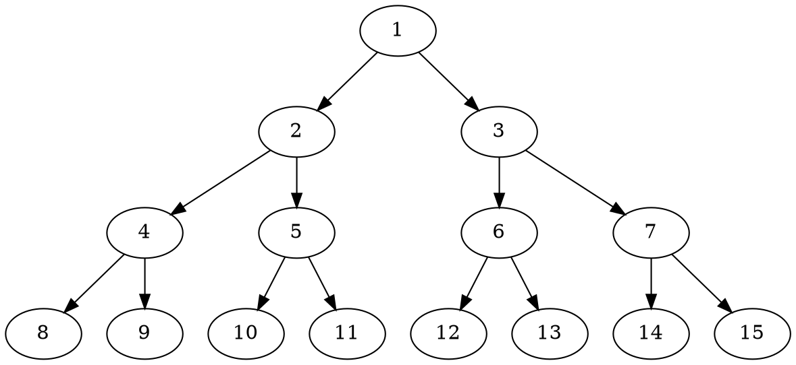

## Homework 3: Search
###### Chris Bollinger
**3.5)**
**3.6)**
A complete problem formulation has 5 components: an *Initial State*, *Actions* available to the agent, the *Transition Model* for moving between states, a *Goal Test*, and a *Path Cost* function that evaluates overall performance

a. Map coloring
* Initial State: a map with no colored sectors
* Actions: apply a color to a sector of the map. The only applicable colors are those not adjacent to the current sector.
* Transition Model: A coloring action generates a new map where the selected sector has the chosen color applied
* Goal Test: All sectors are colored, and no 2 sectors of the same color are touching.
* Path Cost: Each color action has the same cost, so the path cost would be the number of sector colors to reach a solution.

b. Monkey world
* Initial State: A room with a monkey, 2 crates, and some bananas on the ceiling.
* Actions: The monkey can move a box somewhere (including on top of an existing box), or climb a box.
* Transition Model: A new room which has been modified according to the monkey's actions: moving a box returns a new world with the box in the specified position, and climbing a box moves the monkey on top of that box
* Goal Test: The monkey can reach the bananas
* Path Cost: Monkeys can climb pretty fast, so I'd assign a cost of 2 to moving a box, and a cost of 1 to climbing a box

c. Illegal input record
* Initial State: The initial state is a list containing all records, and is marked as containing the invalid record
* Actions: The agent can partition a list, run a list through the program, or discard a list.
* Transition Model: When the agent partitions a list, the next state contains two lists where the presence of the invalid element is unknown. When the agent runs a list through the program, the list is marked as either containing the illegal record if the error occurs, or as not containing the record if there is no error.
* Goal Test: There is a list of length 1 that is known to contain the illegal input record.
* Path Cost: The number of times the program has to be run to reach the goal state.

d. Jugs
* Initial State: Three jugs emptied of water, with capacities 12, 8, and 3.
* Actions: fill container from faucet, pour container into another container, pour container onto ground
* Transition Model: A fill action fills a container fully. A pour action moves water from one container to the other until one container is either empty or full. If pouring onto the ground the container is emptied
* Goal Test: A container has exactly 1 gallon of water in it
* Path Cost: The number of actions required to reach the goal.

**3.8)** Negative Input Paths
a. With arbitrarily large input paths, you must check the entire state space to be optimal. This is because any solution could have an action with a massively negative cost as one of its components, so any solution could be the lowest cost unless fully explored.
b. Given a minimum action cost of c, the problem from part (a) is still present. While the cost of any individual step is limited by c, a long chain of (s,a) pairs with reward c could still accumulate a large negative value. In the case of trees, this means that paths that move much deeper into the search tree can still have costs lower than their parent nodes higher up the tree. In the case of graph search, this similarly means that long redundant routes may still cost less than their shorter counterparts, so we must fully explore the graph to ensure we are not leaving any better solutions out.
c. //TODO
d. In a real travel scenario, the view may be amazing the first time, but eventually repetition lowers the value of the route and the costs of driving (gas, time, driver fatigue) rise. This makes the route no longer worth it, so the cycle ends. Practically speaking, most people I know would consider taking a scenic detour, but would not loop around for another view unless the vista was particularly impressive.
e. One example could be running a small business. In a successful business operation, the costs are slightly negative, enough to make a profit. As long as this cycle continues, the business will thrive and the owner will continue to operate. However, if costs change and the cycle is no longer negative, the owner may sell the business or retire.

**3.15)**
a.

b.
BFS:
DFS-3:
IDS
c.
d.
e.
**3.26)**
**3.27)**
